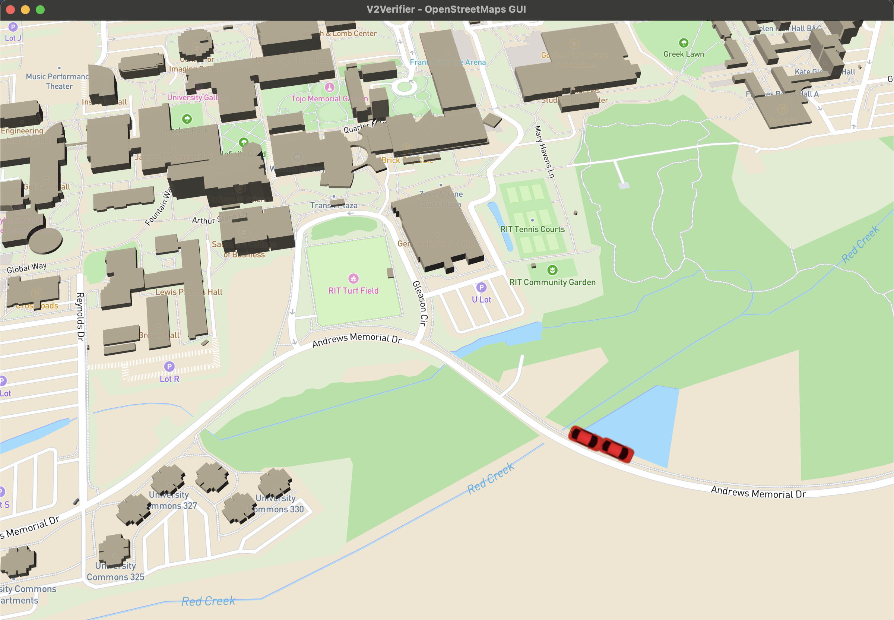

# osm-gui
WebGL front-end GUI for V2Verifier testbed. This interface shows
real-time vehicle location, motion, and direction of travel (as shown below)
rendered on a 3D map built from [OpenStreetMap](https://openstreetmap.org) data.

## Installation

_You will need a [mapbox](https://www.mapbox.com/) key in order 
to render the GUI. Obtain a key (available for free) from [mapbox](https://www.mapbox.com/),
and store it in a file called `key.js` in the 
`osm-gui/open-street-map-gui/webapp/scripts` directory._

Open a terminal and `cd` into `osm-gui` directory. Create a 
new Python virtual environment (e.g., with `virtualenv`) and
activate it.

Install dependencies with

    pip install -r requirements.txt

## Usage
To run the GUI itself, open a separate terminal and `cd` into the
`open-street-map-gui` subdirectory. Launce the GUI (it will open in
Google Chrome, if installed) with

    python gui.py

In the original terminal, run the sample program that renders synthetic
vehicle data on the GUI with 

    python main.py

## Notes

This is an in-progress and heavily under development component of the 
larger [V2Verifier](https://github.com/twardokus/v2verifier) project.
Currently, our GUI is built largely in Javascript, with data from OpenStreeMaps
rendered using WebGL and the [mapbox](https://www.mapbox.com/) toolkit. 